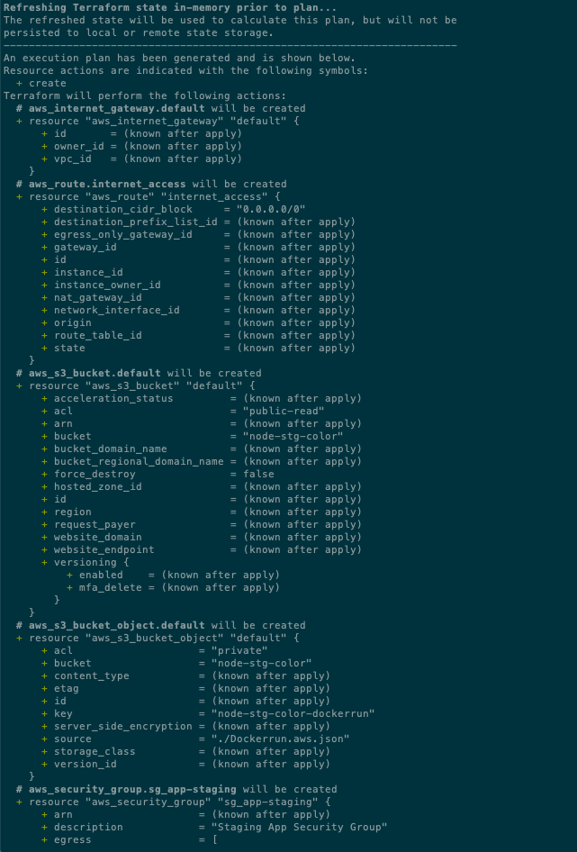
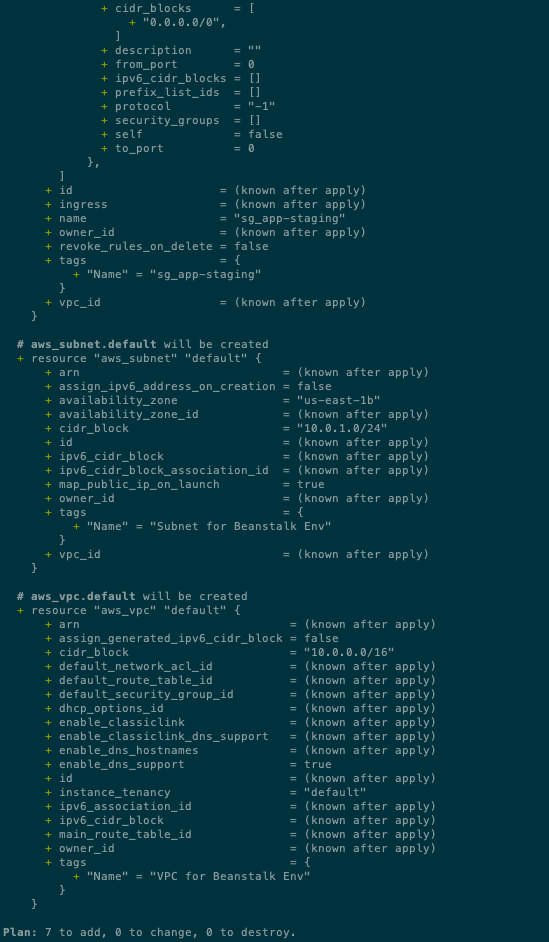
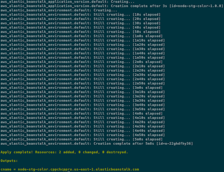
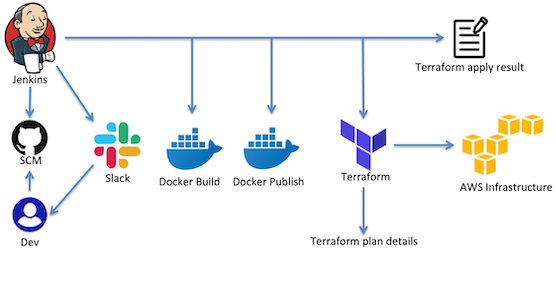
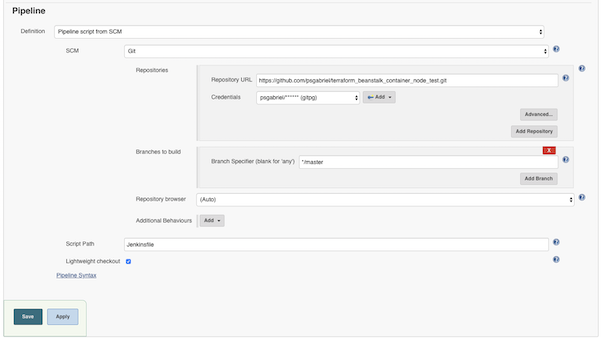
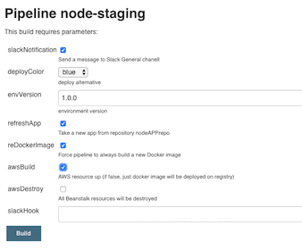

# Dockerized Node.js App on AWS Elastic Beanstalk with Continous Integration Strategy

Terraform and Jenkins scripts to setup AWS Elastic Beanstalk with dockerized load-balanced NodeJS app.

# What these scripts does?
- Build a Docker image with Node APP;
- Publish a Docker image on Docker Registry;
- Create a Clound Computing environment on Amazon Web Server;
- Store Elastic Beanstalk environment informations on AWS S3; 
- Setup the AWS Elastic Beanstalk Application with NodeJS, Elastic Loadbalancer to forward HTTP

## Project repository
https://github.com/psgabriel/terraform_beanstalk_container_node_test

## Node APP Sample
Just to exemplify a Node JS build
https://github.com/nodejs/nodejs.org.git


## References
- Linux SO - https://www.linux.org/
- Github - http://github.com
- NodeJS - https://nodejs.org/en/
- Docker - https://www.docker.com/
- AWS - https://aws.amazon.com
- AWS CLI - https://aws.amazon.com/cli/
- Terraform - https://www.terraform.io/
- Jenkins - https://jenkins.io/

:exclamation: General needs:
- Host with Linux Operational System;
- Internet Access;
- Wget, Git, Docker, Docker-compose, Terraform and Jenkins installed;
- Intermediate knowledge on System Sntegrations, Cloud Computing, Application Deployment and general ideia about Continous Integration.

## Proposed scenario

| Item                    | Resource                | Chain Resource                                  |
|-------------------------|-------------------------|-------------------------------------------------|
| Docker Image Build      | node_stg:latest         |                                                 |
| Docker Image Publish    | psgabriel/node_stg      |                                                 |
| AWS static resources    | S3, VPC, IAM  | Security Group, Subnet, Internet Gateway, Route |
| AWS dinamic resources   | Beanstalk               | Autoscaling and Loadbalancer Policies           |

# Macro steps for manual process:
Without automation or Continous Integration

## 1) Build a new Docker image:
- Clone Node JS App Source from https://github.com/nodejs/nodejs.org.git
- Use the Dockerfile from this project
- Dockerfile Content:

- Build a new Docker image

## 2) Publish the Docker image to a private or public repository:
In this example, I used Docker Hub, but you can choose AWS or Azure Registry, Artifactory, Nexus, etc.
- Dockerized Node App on Docker Hub:


## 3) Deploy of AWS Static Resources:
- Initialize, Plan and Apply the main resources which will be used over APP life circle.




## 4) Deploy of AWS Dinamic Resources:
- In this step, the Terraform will create a new Beanstalk environment to run dockerized Node APP.

```
Note the CNAME with the Web Server Beanstalk URL from Node APP environment
```

# Continous Integration with Jenkins:
Automatic process to build, publish and deploy AWS resources with Jenkins.



## 1) Create a new pipeline project
- From a previous Jenkins instalation, create a new pipeline item, based on https://github.com/psgabriel/terraform_beanstalk_container_node_test repository. Set the Jenkinsfile on Script Path field.


## 2) Run the job
- Some options to customize the jorney


## 3) Check job status

Jenkins stages:
- Checkout SCM - Jenkinsfile read
- Get App - Get NodeAPP Source
- Docker Image Build - Prepare dockerized image
- Docker Hub Publish - Upload Docker image to Dockerhub
- Terraform Init - Terraform initilization
- Terraform Plan - Prepare detailed AWS information about Beanstalk
- AWS Resource buil - Beanstalk Contruction
- AWS Destroy - Beanstalk delete, if necessary
- Post Actions - Slack notification. Successed or failed jobs

## 4) Beanstalk Up
- The Beanstalk Environment URL will be sent to Slack channel.

## 5) AWS Beanstalk Console
node-stg-blue.2rp8bzu49r.us-east-1.elasticbeanstalk.com

