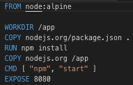
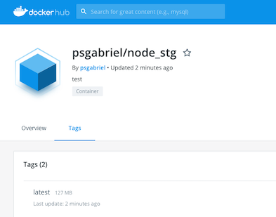

# Dockerized Node.js App on AWS Elastic Beanstalk with Continous Integration Strategy

Terraform and Jenkins scripts to setup AWS Elastic Beanstalk with dockerized load-balanced NodeJS app.

# What these scripts does?
- Build a Docker image with Node APP;
- Publish a Docker image on Docker Registry;
- Create a Clound Computing environment on Amazon Web Server;
- Store Elastic Beanstalk environment informations on AWS S3; 
- Setup the AWS Elastic Beanstalk Application with NodeJS, Elastic Loadbalancer to forward HTTP

## Project repository
https://github.com/psgabriel/terraform_beanstalk_container_node_test

## Node APP Sample
Just to exemplify a Node JS build
https://github.com/nodejs/nodejs.org.git

## References
- Linux SO - https://www.linux.org/
- Github - http://github.com
- NodeJS - https://nodejs.org/en/
- Docker - https://www.docker.com/
- AWS - https://aws.amazon.com
- AWS CLI - https://aws.amazon.com/cli/
- Terraform - https://www.terraform.io/
- Jenkins - https://jenkins.io/

:exclamation: General needs:
- Host with Linux Operational System;
- Internet Access;
- Wget, Git, Docker, Docker-compose, Terraform and Jenkins installed;
- Intermediate knowledge on System Sntegrations, Cloud Computing, Application Deployment and general ideia about Continous Integration.

## Proposed scenario

| Item                    | Resource                | Chain Resource                                  |
|-------------------------|-------------------------|-------------------------------------------------|
| Docker Image Build      | node_stg:latest         |                                                 |
| Docker Image Publish    | psgabriel/node_stg      |                                                 |
| AWS static resources    | S3, Route 53, VPC, IAM  | Security Group, Subnet, Internet Gateway, Route |
| AWS dinamic resources   | Beanstalk               | Autoscaling and Loadbalancer Policies           |

# Macro steps for manual process:
Without automation or Continous Integration

## 1 Build a new Docker image:
- Clone Node JS App Source from https://github.com/nodejs/nodejs.org.git
- Use the Dockerfile from this project
- Dockerfile Content:

- Build a new Docker image

## 2 Publish the Docker image to a private or public repository:
In this example, I used Docker Hub, but you can choose AWS or Azure Registry, Artifactory, Nexus, etc.
- Dockerized Node App on Docker Hub:

